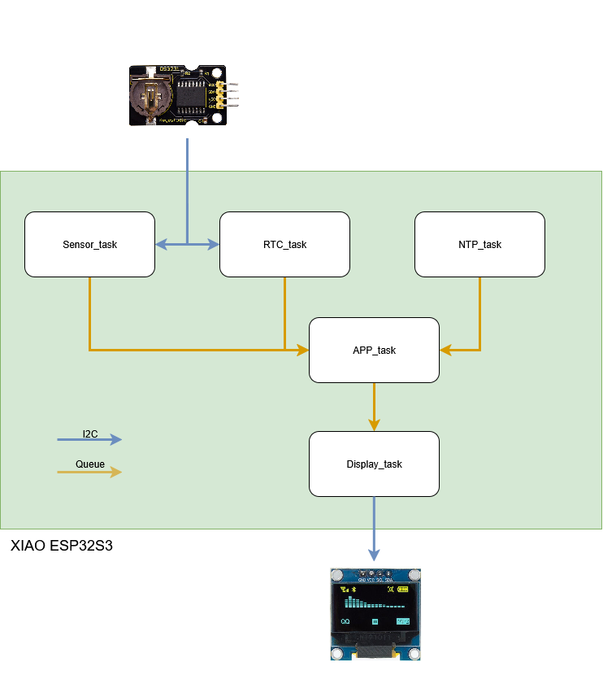

# Project Description - [Digital CodClock]

## Engineered at: 
CodPop (by Ricardo Duarte & Rodrigo Viegas)

## Current Version: 
DCC01-v0.1(Initial)

## Begin Date:
08/10/2025

## End Date:
In Development

## Brief Description:
A desk clock that displays the current time, room temperature, and features an alarm function. 
Built using the Xiao ESP32-S3 microcontroller with DS3231 RTC module for accurate timekeeping and an OLED display for clear visualization.
## Hardware Used:
- **Microcontroller:** Xiao ESP32-S3
- **Real-Time Clock:** DS3231 RTC Module
- **Display:** OLED LCD 128x64 pixels (SSD1315 Drive Chip)
## Software Used:
Arduino IDE

## Notes:
_Project currently in initial development phase._

  

## Project Structure

- **project/**
  - **src/**
    - `main.ino` - Main Arduino sketch
  - **lib/**
    - **RTCManager/** - RTC (DS3231) management library
      - `RTCManager.h`
      - `RTCManager.cpp`
    - **NTPManager/** - NTP synchronization library
      - `NTPManager.h`
      - `NTPManager.cpp`

## Contact Info
- For info, contact: r.roussado2@gmail.com